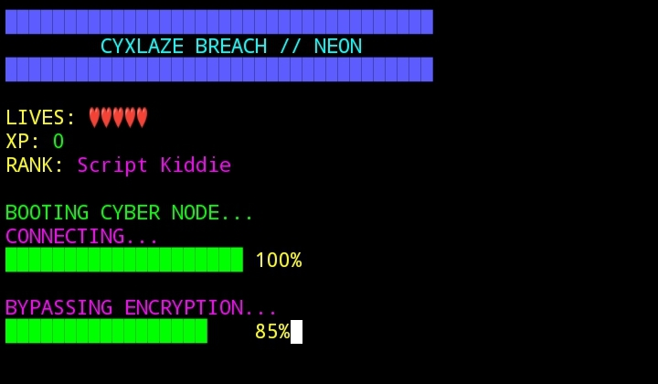
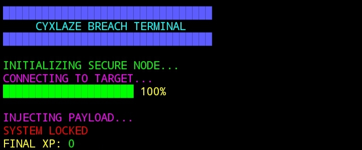

# ⚡ CYXLAZE BREACH

Cyberpunk terminal hacking simulation built with Node.js.

A neon-themed interactive breach engine featuring timed firewall challenges, XP progression, rank system, and multi-stage cyber infiltration designed for CLI-based agent environments.

---

## 🚀 Overview

CYXLAZE BREACH is a real-time terminal hacking simulator with:

- 3-second timed input challenges
- 5 lives system
- XP accumulation
- Rank progression
- Multi-stage firewall bypass
- Neon ANSI cyberpunk interface
- Sound feedback
- Progressive difficulty

Built for immersive CLI interaction and Intercom-compatible agent execution environments.

---

## 🎮 Game Mechanics

- Each stage generates a random access code
- Player has 3 seconds to type the correct code
- Incorrect or late input reduces lives
- XP increases per successful breach
- Rank upgrades automatically based on XP
- Game ends when lives reach zero or breach completes

---

## 🏆 Rank Progression

- Script Kiddie
- Network Raider
- Elite Hacker
- Cyber Overlord

---

## ▶️ How To Run

```bash
git clone https://github.com/Pepencikaladitya/cxylaze-breach.git
cd cxylaze-breach
node index.js
```

Node.js v18+ recommended.

---

## 📸 Preview Game Start



---

## 📸 Preview Game Lose



---

## 🔗 TRAC Address

```
trac1yfd7mm3gz6plecvcsptta3g8w4rvxe6wnq75s86j6jfygcqv859s5vgzyx
```

---

## 🛠 Tech Stack

- Node.js
- Readline Raw Mode
- ANSI Escape Rendering
- Timed Input Logic
- Interval & Promise Control Flow
- CLI Sound Trigger

---

## 🔥 Skills Demonstrated

- Real-time terminal input handling
- Timed challenge architecture
- State management (XP, rank, lives)
- Asynchronous flow control
- Dynamic UI rendering
- Multi-stage game loop design
- Neon ANSI styling
- Interactive CLI UX development
- Minimal dependency system
- Agentic execution compatibility

---

## 📜 License

MIT License

---

Built for terminal-native interactive cyber simulation within modern CLI and Intercom ecosystems.
